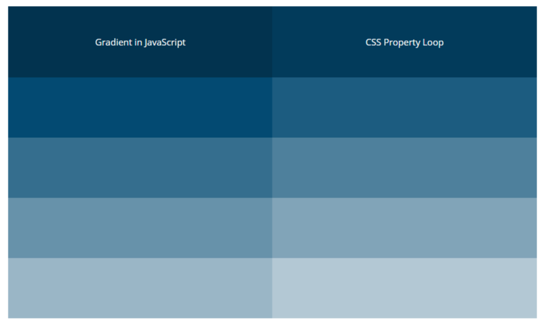

# Scripts--JS-jQuery
 
 # 1. CSS Loop
 Simple script for the automatization of child elements style. 

 - propertie_values - array with values which we want to place in multiple classes
 - class - name of CSS class
 - propertie - CSS propertie to add 
 
 #### Example
 
Let assume you want to add nice gradient background for many divs.
Instead of writing styles for 10 classes you can simply automate it with JavaScript:

```JavaScript
  colors = ['#02334f', '#023b5b', '#034a72', '#1c5c80', '#356e8e', 
            '#4e809c', '#6792aa', '#81a4b8', '#9ab6c6', '#b3c8d4'];
  for (let i = 0; i <= colors.length; i++){
    $('.myclass:nth-child('+ (i+1) + ')').css('background-color', colors[i]);
  }
```
and output will be:



# 2. addStyleOnContactForm

Script was written for Contact Form. Displays text if you do not check the required checkboxes. 
It works only for first click. After that new element won't show untill page reload (it can be change by switch '.one' to '.on')

- elementToClick - element of the page which after clicking will add a new text (in this example it's p element after 'submit' input) 


